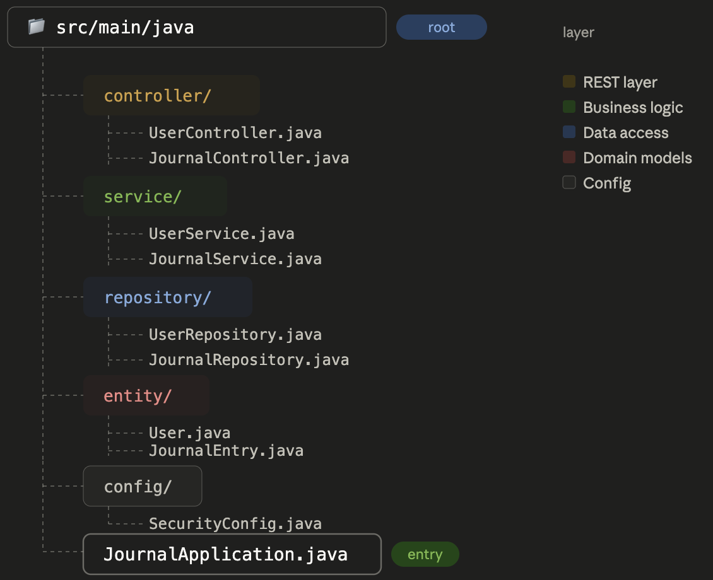

# Journal App

A full-stack journal management application designed to help users create, organize, and manage personal journal entries securely.

> Status: Active Project  
> Core functionality is implemented

---

## Features

- User management APIs
- Journal CRUD operations
- MongoDB integration
- RESTful backend architecture
- Layered Spring Boot application structure

---

## Future Enhancements

- Spring Security integration
- JWT authentication and authorization
- Password encryption
- Search and filtering
- Tags and categories for journal entries
- File and image attachments
- Swagger/OpenAPI documentation
- Docker support
- CI/CD pipeline
- Cloud deployment
- Automated testing and monitoring

---

## Tech Stack

### Backend

- Java
- Spring Boot
- Spring Data MongoDB
- Maven
- Lombok

### Database

- MongoDB

### Frontend (Planned)

- React
- TypeScript
- Tailwind CSS
- REST API Integration

---

## 📂 Project Architecture

  

---

## Getting Started

### Prerequisites

- Java 17+
- Maven
- MongoDB

## API Overview

### User APIs

| Method | Endpoint |
|----------|----------|
| GET | /user |
| POST | /user |
| PUT | /user |
| DELETE | /user |

### Journal APIs

| Method | Endpoint |
|----------|----------|
| GET | /journal |
| POST | /journal |
| PUT | /journal/{id} |
| DELETE | /journal/{id} |

---

## Author

Aditya Saraswat

---

⭐ If you found this project interesting, consider starring the repository.
