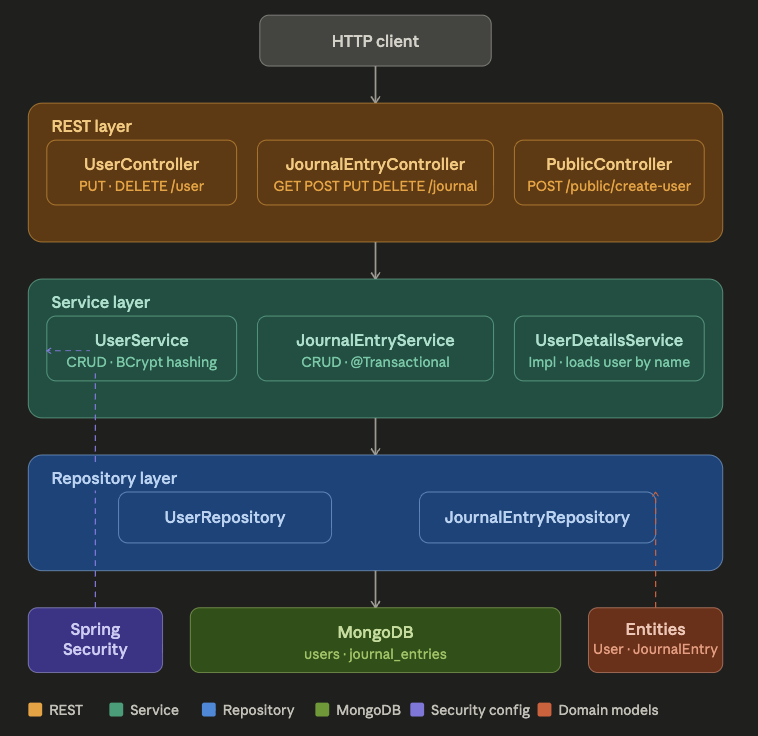

# Journal App

A personal journal management backend built with Spring Boot and MongoDB.

> **Status:** Active development  
> Core functionality is complete. Spring Security with BCrypt password encoding is implemented.

---

## Features

- User registration with **BCrypt password hashing**
- **Spring Security** with HTTP Basic authentication and stateless sessions
- **Role-based access control** (`USER` role assigned on registration)
- Journal entry **CRUD** operations scoped to the authenticated user
- **MongoDB transactions** (`@Transactional`) for atomic journal and user updates
- RESTful backend with a clean Controller → Service → Repository architecture
- Public endpoints for health checks and user registration

---

## Tech Stack

| Layer | Technology |
|---------|------------|
| Language | Java 8 |
| Framework | Spring Boot 2.7.16 |
| Security | Spring Security · BCryptPasswordEncoder |
| Persistence | Spring Data MongoDB |
| Build Tool | Maven |
| Boilerplate Reduction | Lombok |
| Database | MongoDB |

---

## Project Architecture

<div align="center">
  
</div>

---

## Repository Structure

```text
journalApp
│
├── backend
│   ├── assets
│   │   └── architecture.png
│   ├── src
│   ├── pom.xml
│   ├── mvnw
│   └── mvnw.cmd
│
└── .gitignore
```

---

## API Reference

### Public Endpoints (No Authentication Required)

| Method | Endpoint | Description |
|----------|----------|-------------|
| `GET` | `/public/health-check` | Returns `"Ok"` |
| `POST` | `/public/create-user` | Register a new user |

---

### User Endpoints (Authentication Required)

| Method | Endpoint | Description |
|----------|----------|-------------|
| `PUT` | `/user` | Update username and/or password |
| `DELETE` | `/user` | Delete authenticated user |

---

### Journal Endpoints (Authentication Required)

| Method | Endpoint | Description |
|----------|----------|-------------|
| `GET` | `/journal` | Get all journal entries |
| `POST` | `/journal` | Create a journal entry |
| `GET` | `/journal/id/{id}` | Get journal entry by ID |
| `PUT` | `/journal/id/{username}/{id}` | Update journal entry |
| `DELETE` | `/journal/id/{username}/{id}` | Delete journal entry |

> All `/journal/**` and `/user/**` endpoints require HTTP Basic Authentication. Unauthenticated requests return `401 Unauthorized`.

---

## Getting Started

### Prerequisites

- Java 8 or higher
- Maven 3.6+
- MongoDB (Local or Atlas)

### Clone Repository

```bash
git clone https://github.com/adityasx69/journalApp.git
cd journalApp/backend
```

### Configure MongoDB

Update:

```text
src/main/resources/application.properties
```

```properties
spring.data.mongodb.uri=mongodb://localhost:27017/journaldb
```

### Run Application

```bash
mvn spring-boot:run
```

Application starts on:

```text
http://localhost:8080
```

---

## MongoDB Collections

### users

| Field | Type | Description |
|---------|------|-------------|
| `_id` | ObjectId | Primary Key |
| `userName` | String | Unique Username |
| `password` | String | BCrypt Hashed Password |
| `journalEntries` | DBRef[] | References to journal entries |
| `roles` | String[] | User roles |

---

### journal_entries

| Field | Type | Description |
|---------|------|-------------|
| `_id` | ObjectId | Primary Key |
| `title` | String | Journal title |
| `content` | String | Journal content |
| `date` | LocalDateTime | Creation timestamp |

---

## Security

Current security implementation includes:

- Spring Security
- HTTP Basic Authentication
- BCrypt password hashing
- Stateless session management
- Role-based authorization
- Protected user and journal endpoints

---

## Planned Enhancements

- [ ] JWT Authentication
- [ ] Swagger / OpenAPI Documentation
- [ ] Search and Filtering
- [ ] Tags and Categories
- [ ] File and Image Attachments
- [ ] Docker Support
- [ ] GitHub Actions CI/CD Pipeline
- [ ] AWS / GCP Deployment
- [ ] Unit & Integration Testing (JUnit + Mockito)
- [ ] React + TypeScript Frontend

---

## Author

**Aditya Saraswat**

- GitHub: https://github.com/adityasx69
- LinkedIn: https://www.linkedin.com/in/aditya-saraswat-0b8170297/

---

⭐ If you found this project useful, consider giving it a star.
